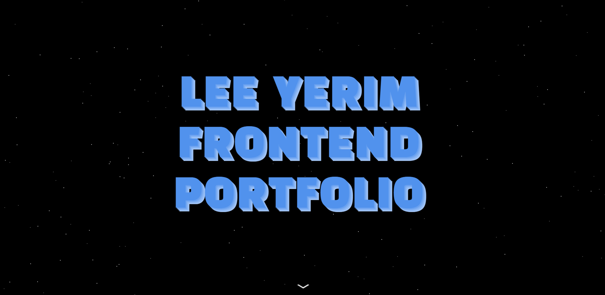
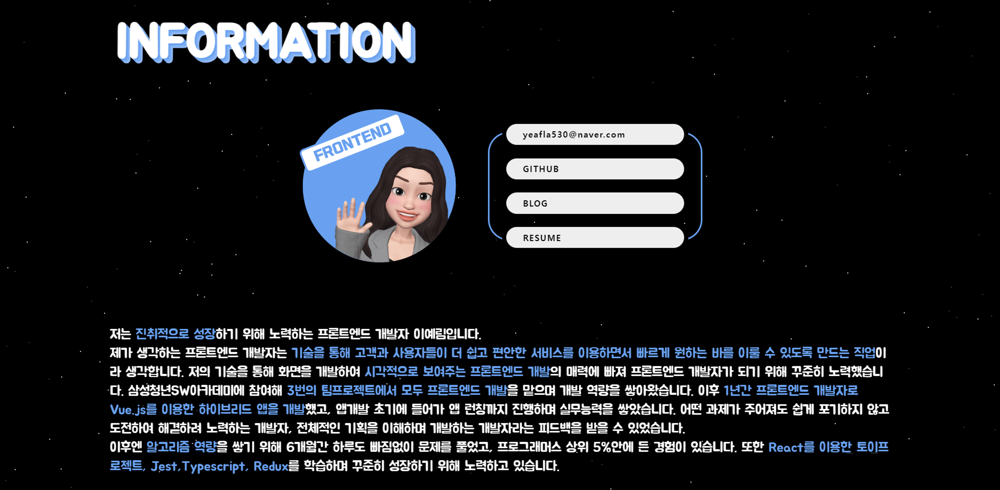
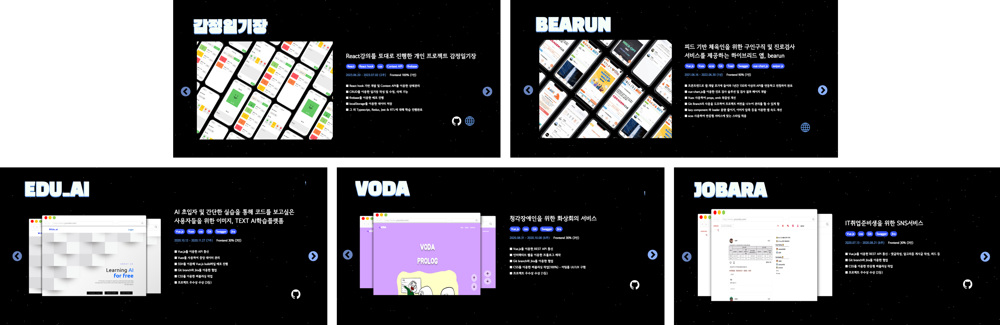

# ✅ React Portfolio

## ✔ Start

```
cd PORTFOLIO
npm i
npm start
```


### 배포 URL

`https://yerim-portfolio.web.app/`


## ✔ Content

> React를 이용해 프로젝트를 정리한 포트폴리오 개발
>
> animation을 많이 활용하여 개발한 점이 특징









## ✔ 참조

[animation library 추천 블로그]: https://velog.io/@toquf0797/%EC%95%A0%EB%8B%88%EB%A9%94%EC%9D%B4%EC%85%98%EC%9D%B4-%EC%9E%88%EB%8A%94-%EB%9E%9C%EB%94%A9%ED%8E%98%EC%9D%B4%EC%A7%80-%EB%8F%84%EC%A0%84-fullPage-gsap-slick	"animation library 추천 블로그"

[flaticon : free icon site]: https://www.flaticon.com/kr/


## ✔ library

1. fullpage : page animation library

   ```
   npm i @ap.cx/react-fullpage
   ```

2. react-slick : component animation library

   ```
   npm i react-slick
   ```

3. animate.css : element animation library

   ```
   npm i animate-css
   ```

   


